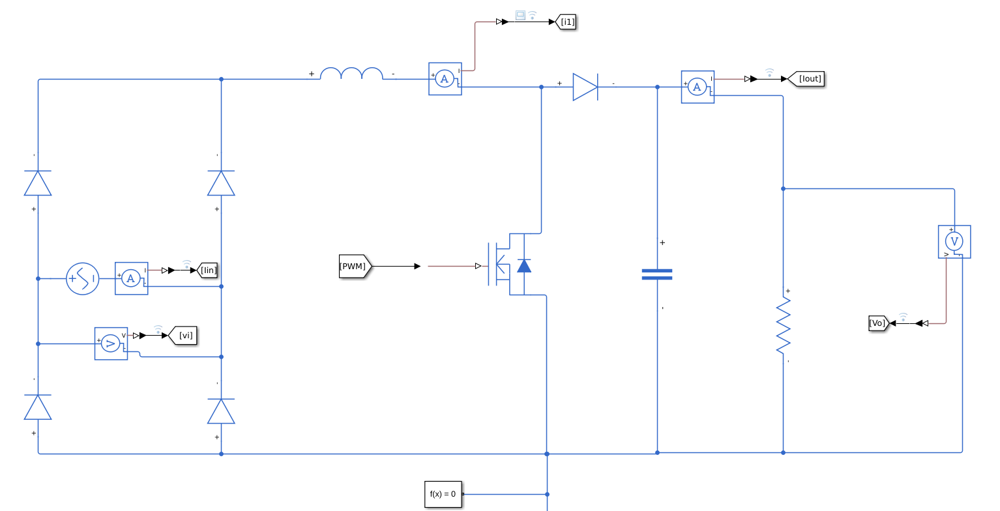
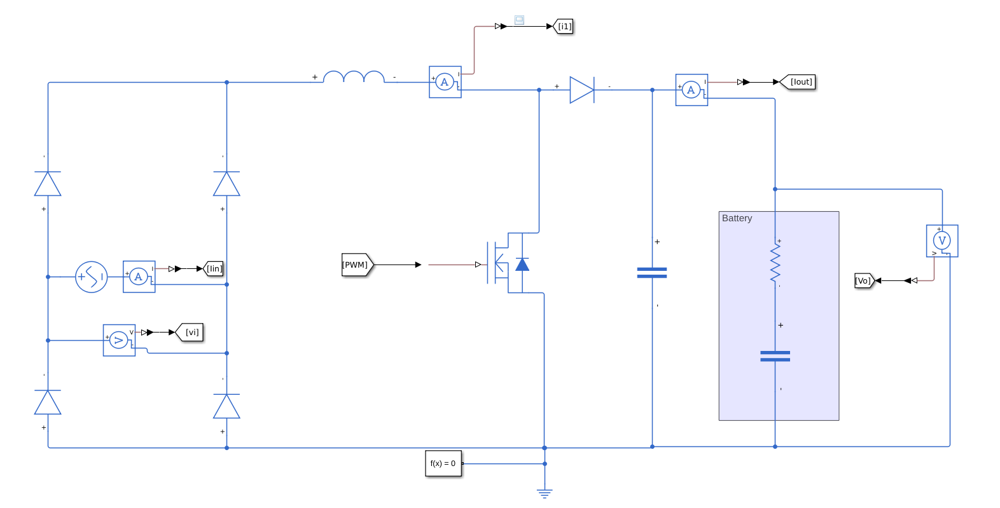
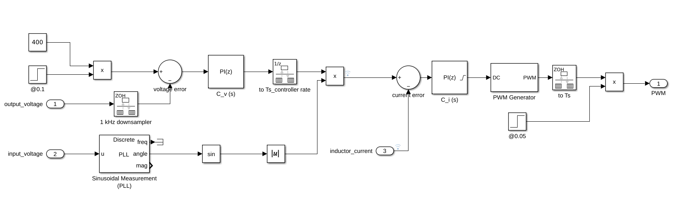
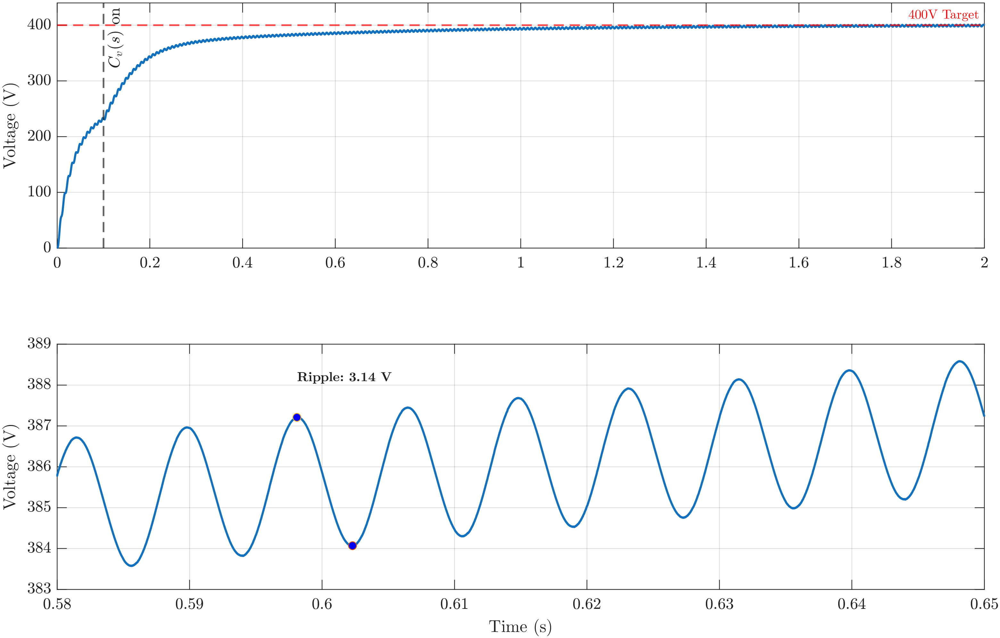
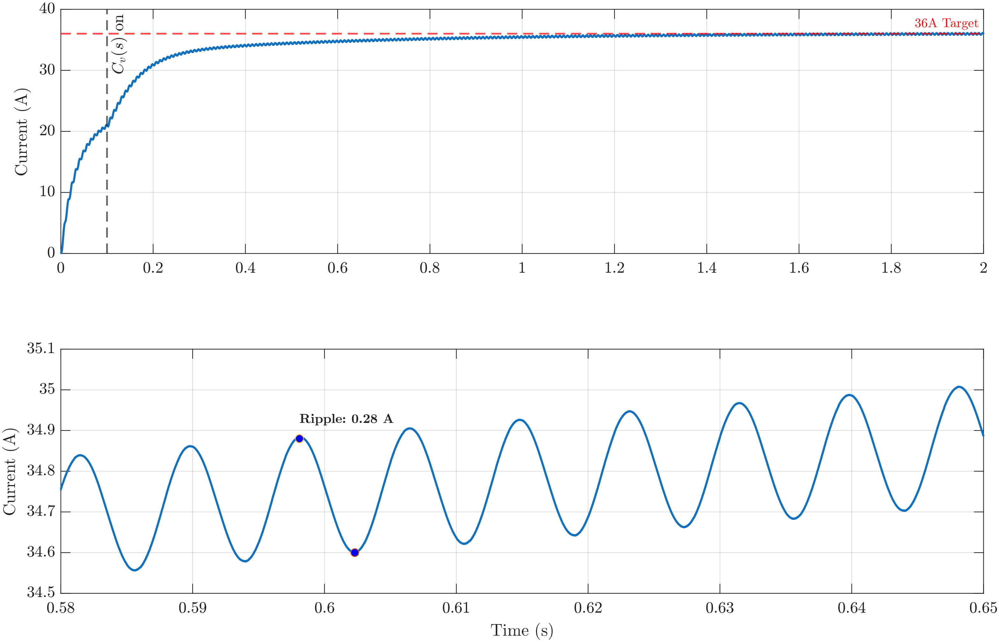
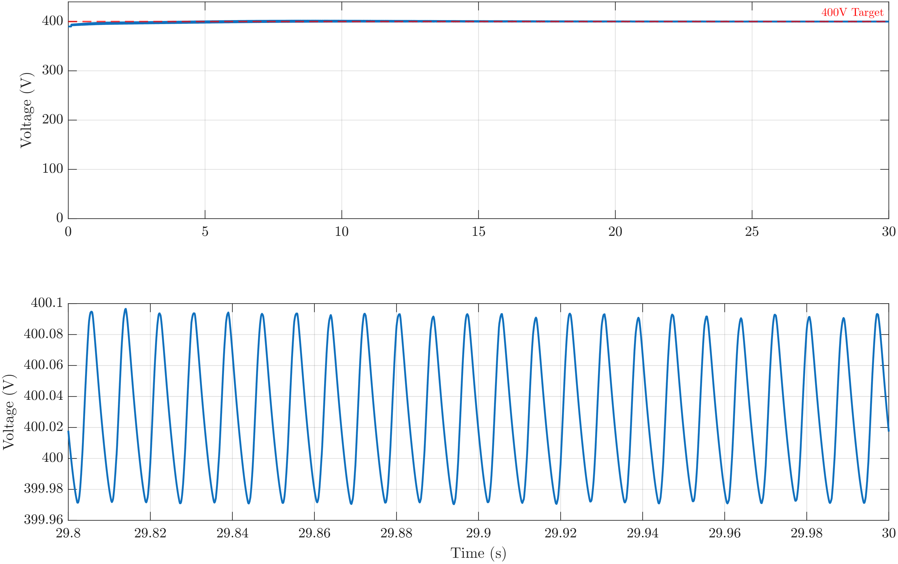
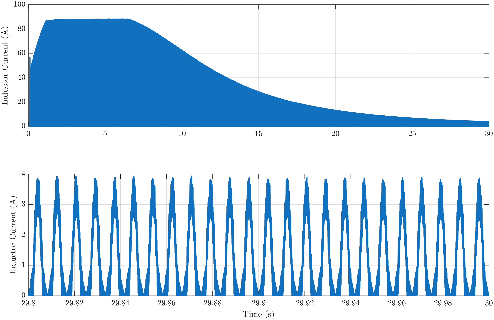
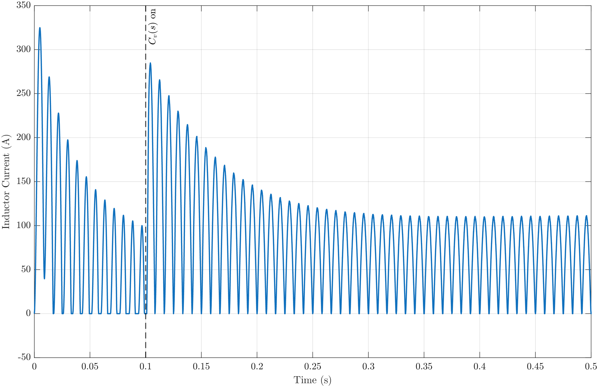
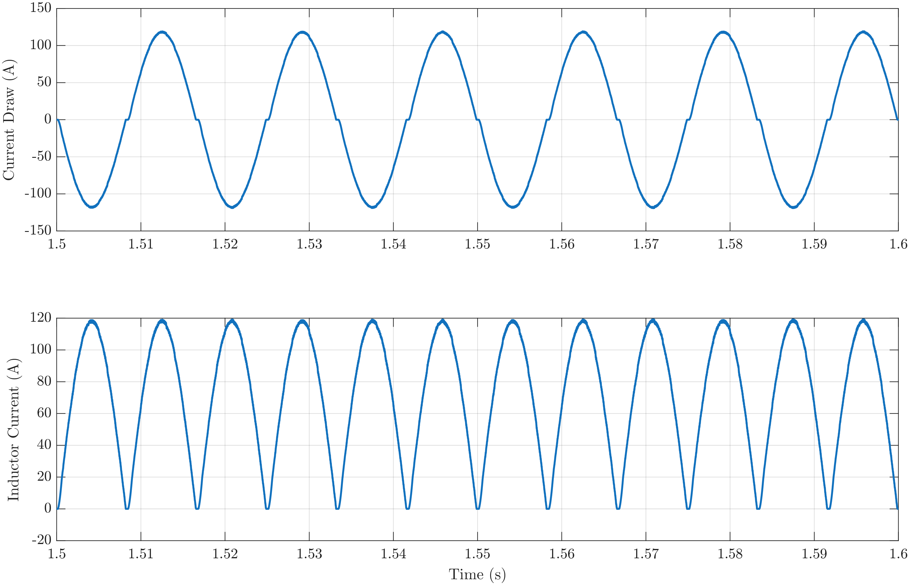
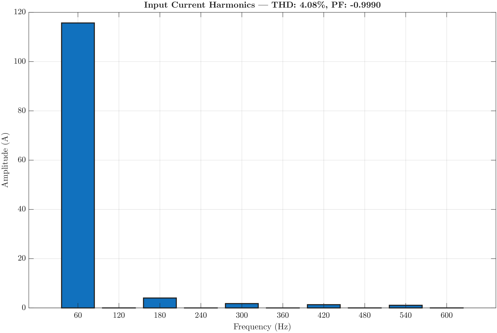

# PFC Rectifier Design and Simulation

## How To Run This Project: 

1. git clone this repo:
```
git clone https://github.com/abd-alaj/PFC_rectification_EV_Project.git
```
2. in the `Simulink/` directory, run the script `PFC_params.m` prior to running any of the simulink models. 

## Project Description

### Situation
The project involves designing a single-phase boost Power Factor Correction (PFC) rectifier intended for electric vehicle charging applications, converting 240V RMS AC to a 400V DC output.

### Task
The objective was to size power stage components, derive a small-signal average model, design a cascaded PI controller. in the endeavour of doing so, a PLL and soft start functionality was added.

### Action
A boost converter topology was modeled using an uncontrolled full-bridge rectifier. Component values for the inductor and output capacitor were determined based on continuous conduction mode (CCM) requirements and ripple constraints. A linearized small-signal model was developed to design nested PI controllers for current and voltage regulation. Simulations were conducted in Simulink to test the controller against both static resistive loads and dynamic RC battery models.

### Result
The design achieved: 
*  a Power Factor of 0.9990
*  a Total Harmonic Distortion (THD) of 4.08% 
* The system demonstrated stable transient response and successful regulation under varying loads. 
 
> **note:** a 99.9% power factor is unrealistic and is due to the ideal conditions presented in a simulation. Most switching losses along with passive component parasitics were not considered in this case. 

# Project Visuals

### Plant and Load Models
**Resistive Load Model:** 
**RC Battery Model:** 
**Control Topology** 

### Performance Analysis
**Resistor Load (Single R):**
    
    
Current ripple in the static resistive load model is approximately 0.3 A. there are two transient curves, one is caused by the PWM turning on with an uncontrolled duty cycle. The voltage controller, denoted as $C_v (s)$, was turned on after a delay of 0.1 seconds. The line at which the controller is turned on is denoted in all relevant graphs. 

**RC Load Modeling:**
    
    
 

**Inductor Current and Grid Analysis:**

The figure below illustrates the inductor current within the boost PFC stage. A startup delay is intentionally implemented in the controller to mitigate high inrush current. Without this delay, the initial simulation transient produces current spikes peaking near 500 A. These levels exceed the inductor's saturation limits and risk hardware damage. Delaying the controller activation ensures these peaks remain within manageable operational boundaries.
    
    
**Harmonic Analysis:**
    
> Disregard the PF calculation being -0.9990, the PF is supposed to be positive and is negative due to a calculation error. 